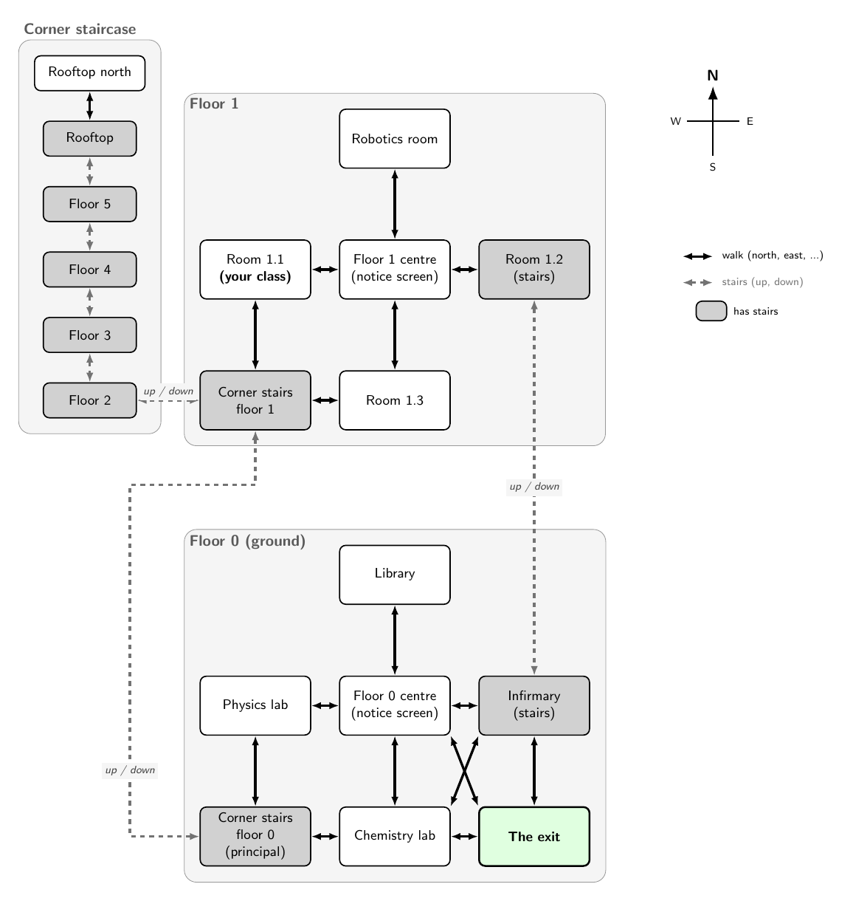

# Leave at all costs

A short text adventure (Scala 3 + Swing) about escaping the most boring Civics class of your
life. Make a few choices, then explore the school and find a way through the locked exit —
**at all costs**. There are 10 endings to collect, each attempt has 40 turns.



## Playing

You need Java 8 or newer.

```sh
java -jar "At all costs (executable).jar"
```

Keep `map.png` next to the `.jar`: the in-game **Program → Map** menu opens it. After an ending,
use **Program → Try again**; the endings you have reached are remembered.

The full player guide, the map and a (spoiler) walkthrough are in [README.pdf](README.pdf).

## Repository layout

| Path | Contents |
| --- | --- |
| `At all costs (executable).jar` | The runnable game |
| `README.pdf`, `map.png` | Player guide and school map, generated from `docs/` |
| `docs/README.tex` | Source of the player guide |
| `docs/school-map.tex`, `docs/map.tex` | TikZ source of the school map |
| `src/At all costs/adventure/adventure/` | Game source code |
| `src/At all costs/lib/` | Libraries (only `scala-swing` is used) |

Source files:

- `Adventure.scala` – the game world, the rules and the turn loop
- `Player.scala` – the player's location, inventory and interactions with people
- `Area.scala`, `Item.scala`, `NPC.scala` – the building blocks of the world
- `Action.scala` – parses typed commands
- `Ending.scala` – the list of endings and the ways to unlock the exit
- `ui/AdventureGUI.scala` – the Swing window

## Building

**Game.** Open `src/At all costs` in IntelliJ IDEA with the Scala plugin (Scala 3.3 or newer)
and run `adventure.ui.AdventureGUI`, or compile by hand:

```sh
cd "src/At all costs"
scalac -classpath lib/scala-swing_3-3.0.0.jar -d out $(find adventure -name '*.scala')
scala -classpath out:lib/scala-swing_3-3.0.0.jar adventure.ui.AdventureGUI
```

The executable jar bundles the compiled classes with the Scala 3 standard library and
`scala-swing` (main class `adventure.ui.AdventureGUI`).

**Documentation** (needs a LaTeX distribution with TikZ and `pdftoppm` from Poppler):

```sh
cd docs
pdflatex map.tex && pdftoppm -png -r 150 -singlefile map.pdf ../map
pdflatex README.tex && pdflatex README.tex && cp README.pdf ..
cp ../map.png ../README.pdf "../src/At all costs/"
```

## License

MIT, see [LICENSE](LICENSE).
